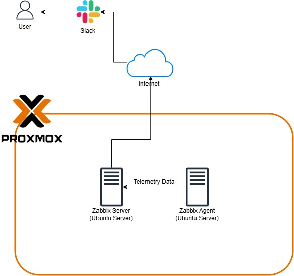
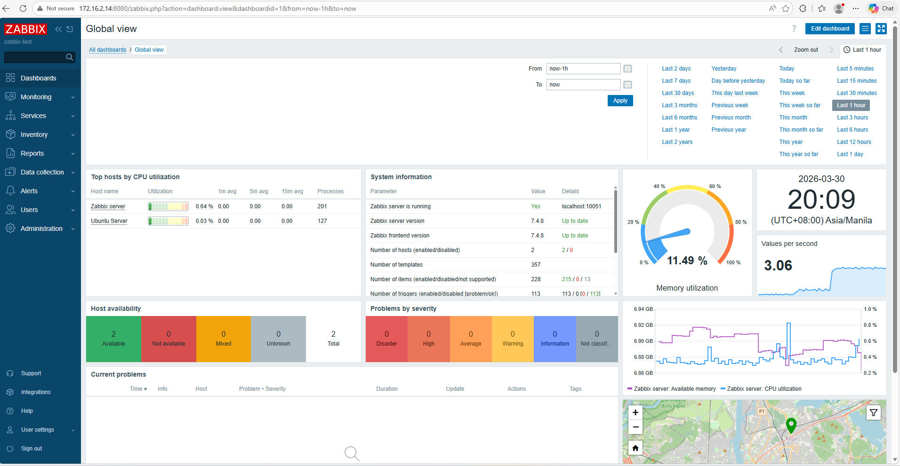
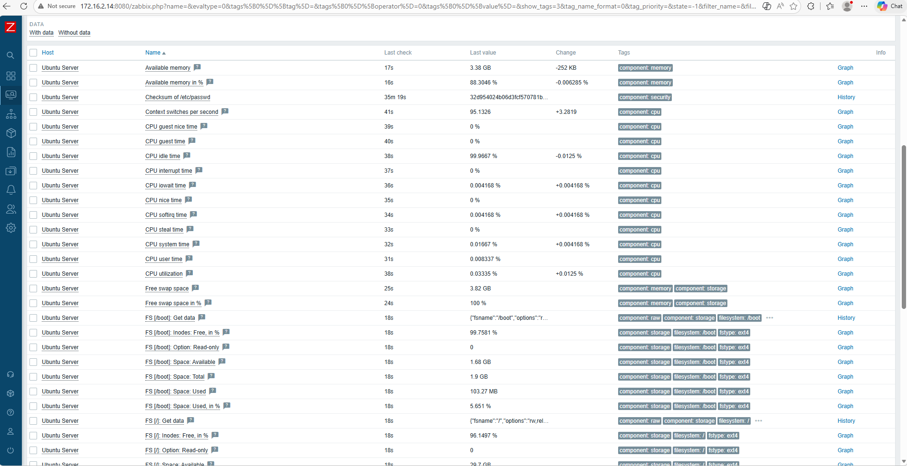
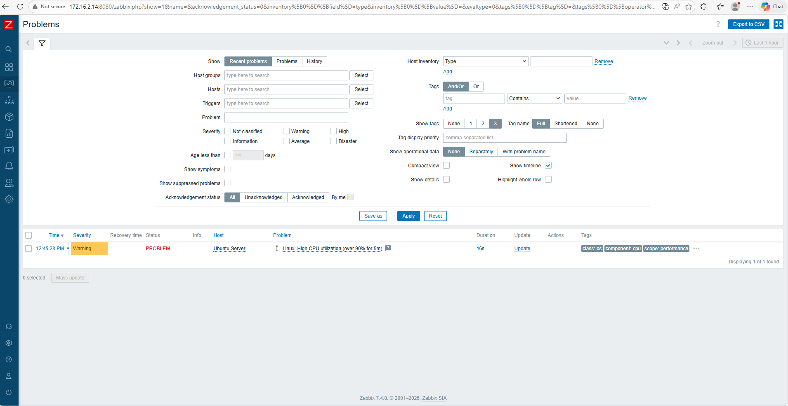

# Zabbix Monitoring Setup

Personal Zabbix 7.4 lab.

## Overview

This documentation shows the process of setting up Zabbix as an open source tool used for monitoring resources, performance and network traffic on a Server.
This documents that zabbix can be installed in a virtual machine, making it also suitable for containerization such as Docker, Kubernetes and LXC. 

The Setup contains two components
- Zabbix Server: Centralizes the collection of data from monitored devices, processes metrics, evaluates triggers (based on thresholds for Problems), generates
alerts and stores historical data
- Zabbix Agent: A lightweight that is installed on a host that will be monitored (servers, VMs etc.) They are the ones pushing data to the Zabbix Server or
responds to server polls.

## Tech Stack

- Proxmox VE (For virtualization)
- Zabbix 7.4
- MariaDB
- Nginx + PHP 8.3
- Zabbix Agent 2 (on monitored hosts)

## Setup

  

The illustration shows a simple setup of Zabbix Server and Agent as a Virtual Machine inside Proxmox. The environment shows Zabbix Agent sends Telemetry data to Zabbix Server.
Not only that it also provide sending an alert by emailing the User through Slack.

## Directories

  
| Section              | Directory/Path                                      | Description                                                 | Links                                           |
|----------------------|-----------------------------------------------------|-------------------------------------------------------------|-------------------------------------------------|
| **Docs**             | `docs/installation.md`                              | Full installation steps for Zabbix Server + MariaDB + Nginx | [View](docs/installation.md)                    |
| **Docs**             | `docs/hosts.md`                                     | List of monitored hosts and how they were added             | [View](docs/hosts.md)                           |
| **Docs**             | `docs/templates.md`                                 | Used templates and custom triggers                          | [View](docs/templates.md)                       |
| **Docs**             | `docs/troubleshooting.md`                           | Common issues and solutions                                 | [View](docs/troubleshooting.md)                 |
| **Configs**          | `configs/zabbix_server.conf`                        | Main Zabbix Server configuration                            | [View](configs/zabbix_server.conf)              |
| **Configs**          | `configs/zabbix_agent2.conf`                        | Example Agent 2 configuration                               | [View](configs/zabbix_agent2.conf)              |
| **Configs**          | `configs/nginx.conf`                                | Nginx configuration for Zabbix frontend                     | [View](configs/nginx.conf)                      |

## Results

  
  
Dashboard

  
  
Resources that was collected from Ubuntu Server

  
  
Zabbix shows a Warning Severity Problems on Ubuntu Server, showing High CPU Utilization

