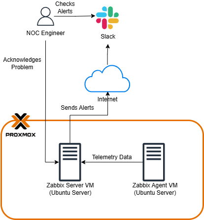

# Zabbix Monitoring Setup with Slack Notifications

Personal Zabbix 7.4 lab.

## Overview

This documentation covers the setup of Zabbix as an open source monitoring solution for tracking infrastructure resources and performance metrics. 
The entire environment was built as a lab in a virtualized setup using Proxmox VE. Zabbix Server was installed with MariaDB as the backend database and
Nginx + PHP 8.3 for web front end. Slack integration was added to deliver real-time alert notifications.

## Main Components
- Zabbix Server: Centralizes the collection of data from monitored devices, processes metrics, evaluates triggers (based on thresholds for Problems), generates
alerts and stores historical data
- Zabbix Agent 2: A lightweight that is installed on a host that will be monitored (servers, VMs etc.) They are the ones pushing data to the Zabbix Server or
responds to server polls.

## Tech Stack

- Proxmox VE - Virtualization platform
- Zabbix 7.4 - Monitoring platform
- MariaDB - Database backend
- Nginx + PHP 8.3 - Web service and frontend
- Zabbix Agent 2 - Installed on a monitored hosts

## Architecture

  

This diagram illustrates a Zabbix monitoring architecture deployed as virtual machines within a Proxmox environment.

The Zabbix Agent continuously collects telemetry data such as performance metrics, system health, resource utilization and sends it to Zabbix Server.
When a predefined trigger condition is met (e.g., High CPU Usage, Service Failure or interface issues), the Zabbix Server processes the data and sends real-time
alert notifications via the internet to a Slack workspace.

The NOC Engineer monitors these alerts in Slack, investigates the issues which often by following direct links back to the Zabbix Interface and acknowledges or updates
the problem status directly in Zabbix, completing the monitoring and incident response loop.

## Directories

  
| Section              | Directory/Path                                      | Description                                                 | Links                                           |
|----------------------|-----------------------------------------------------|-------------------------------------------------------------|-------------------------------------------------|
| **Docs**             | `docs/installation.md`                              | Full installation steps for Zabbix Server + MariaDB + Nginx | [View](docs/installation.md)                    |
| **Docs**             | `docs/hosts.md`                                     | List of monitored hosts and how they were added             | [View](docs/hosts.md)                           |
| **Docs**             | `docs/templates.md`                                 | Used templates and custom triggers                          | [View](docs/templates.md)                       |
| **Docs**             | `docs/troubleshooting.md`                           | Common issues and solutions                                 | [View](docs/troubleshooting.md)                 |
| **Configs**          | `configs/zabbix_server.conf`                        | Main Zabbix Server configuration                            | [View](configs/zabbix_server.conf)              |
| **Configs**          | `configs/zabbix_agent2.conf`                        | Example Agent 2 configuration                               | [View](configs/zabbix_agent2.conf)              |
| **Configs**          | `configs/nginx.conf`                                | Nginx configuration for Zabbix frontend                     | [View](configs/nginx.conf)                      |

## Results

  
  
Dashboard

  
  
Zabbix Alerted High CPU Usage from Warning to High Severity Problems on Ubuntu Server

  
  
Slack Notification of High CPU Alerts

