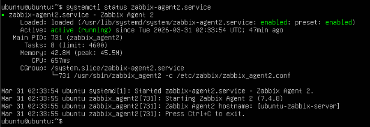

<h1>Zabbix Server and Agent Installation</h1>

<p>There are different methods on how to setup and install Zabbix. But for this documentation, Zabbix will be installed by Packages</p>

## Requirements
- OS Distribution & Version
  - Ubuntu 24.04 Noble (amd 64)
- Zabbix Packages
  - Zabbix version 7.4
  - Zabbix Server
  - Zabbix Agent 2
- Databases
  - MariaDB or MySQL
- Web Service and PHP
  - Nginx + PHP 8.3

<h1>Proxmox VE - VM setup</h1>

1. Create two new VMs:
   - Zabbix Server VM
       - Specifications: 4 vCPU, 8 GB RAM, 80 GB Disk
   - Zabbix Agent VM
       - Specifications: 4 vCPU, 4 GB Ram, 80 GB Disk
3. Install Ubuntu 24.04 LTS on both VMs
4. Installation Process

<h1>Zabbix Server Installation and Configuration</h1>

## 1. Enter as Root user and update and upgrade packages
```bash
sudo -s
apt update && apt upgrade -y
```
## 2. Install Zabbix Repository
```bash
wget https://repo.zabbix.com/zabbix/7.4/release/ubuntu/pool/main/z/zabbix-release/zabbix-release_latest_7.4+ubuntu24.04_all.deb
dpkg -i zabbix-release_latest_7.4+ubuntu24.04_all.deb
apt update
```
## 3. Install Zabbix Server Packages
```bash
apt install zabbix-server-mysql zabbix-frontend-php zabbix-nginx-conf zabbix-sql-scripts zabbix-agent
```

## 4. Install MariaDB or MySQL
```bash
apt install mariadb-server mariadb-client -y
mysql_secure_installation

mysql -u `root` -p `password`
```
## 5. Create Initial Database
```bash
create database zabbix character set utf8mb4 collate utf8mb4_bin;
create user zabbix@localhost identified by 'password';
grant all privileges on zabbix.* to zabbix@localhost;
set global log_bin_trust_function_creators = 1;
quit;

zcat /usr/share/zabbix/sql-scripts/mysql/server.sql.gz | mysql --default-character-set=utf8mb4 -uzabbix -p zabbix

mysql -u `root` -p `password`
set global log_bin_trust_function_creators =0;
quit;
```
## 6. Edit file `/etc/zabbix/zabbix_server.conf`
Add this inside the file
`DBPassword=password`

## 7. Edit file `/etc/zabbix/ngin.conf` and uncomment and set 'listen' and 'server_name' drectives.
`listen 8080;`
`server_name` `<Hostname or IP Address>`

## 8. Start Zabbix server and agent processes
```bash
systemctl start zabbix-server zabbix-agent nginx php8.3-fpm
systemctl enable zabbix-server zabbix-agent nginx php8.3-fpm
```
Verify also

```bash
systemctl status zabbix-server
```
## 9. (OPTIONAL) To enable Remote access, Install OpenSSH Server if it is not yet installed upon installation of Ubuntu.

```bash
apt install openssh-server
systemctl start openssh-server
systemctl enable openssh-server
```

<div align="center">
  
  <p>Zabbix Server installed successfully</p>
</div>

<h1>Zabbix Agent Installation and Configuration</h1>

Step 1 - 2 Are the same procedure on installing Zabbix Server. We can skip to Step 3

## 3. Install Zabbix Agent 2
```bash
apt install zabbix-agent2
```

## 4. Install Zabbix agent 2 plugins
```bash
apt install zabbix-agent2-plugin-mongodb zabbix-agent2-plugin-mssql zabbix-agent2-plugin-postgresql
```

## 5. Start Zabbix agent 2 process
```bash
systemctl start zabbix-agent2
systemctl enable zabbix-agent2
```

Verify also

```bash
systemctl status zabbix-agent2
```

## 6. (OPTIONAL) To enable Remote access, Install OpenSSH Server if it is not yet installed upon installation of Ubuntu.
```bash
apt install openssh-server
systemctl start openssh-server
systemctl enable openssh-server
```

<div align="center">
  
  <p>Zabbix Agent installed successfully</p>
</div>


<h1>References</h1>

[Zabbix Server Official Installation Guide and Documentation](https://www.zabbix.com/download?zabbix=7.4&os_distribution=ubuntu&os_version=24.04&components=server_frontend_agent&db=mysql&ws=apache)

[Zabbix Agent Official Installation Guide and Documentation](https://www.zabbix.com/download?zabbix=7.4&os_distribution=ubuntu&os_version=24.04&components=agent_2&db=&ws=)
