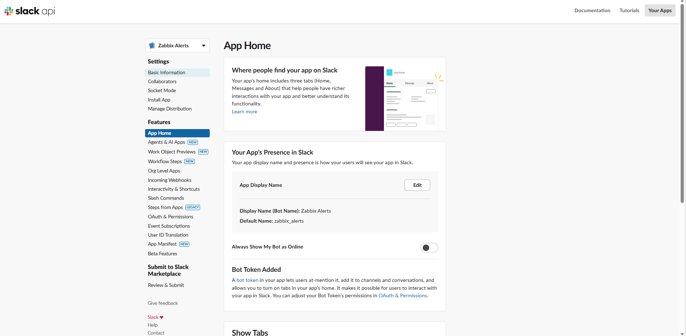
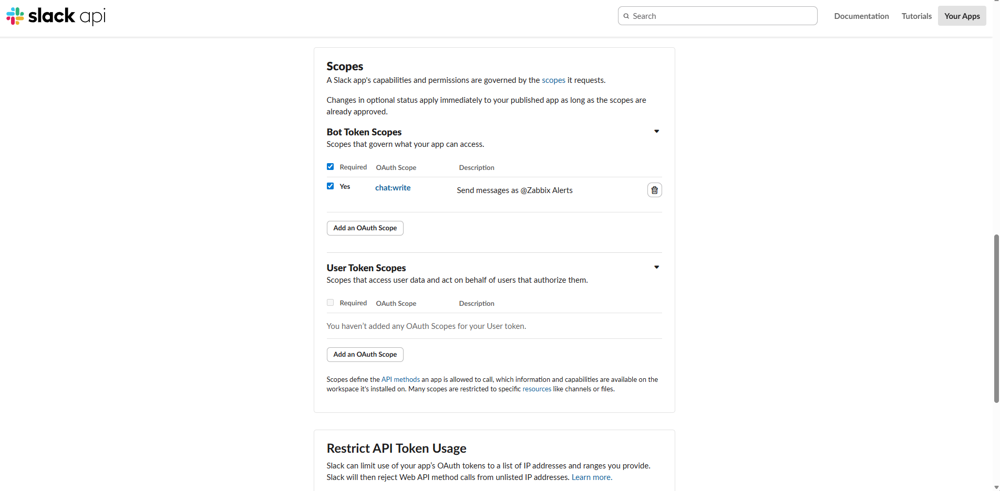
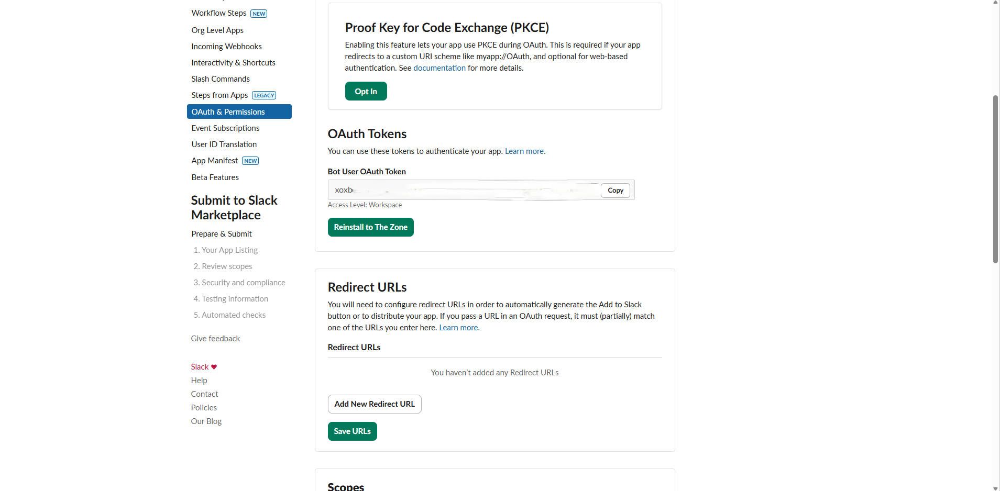
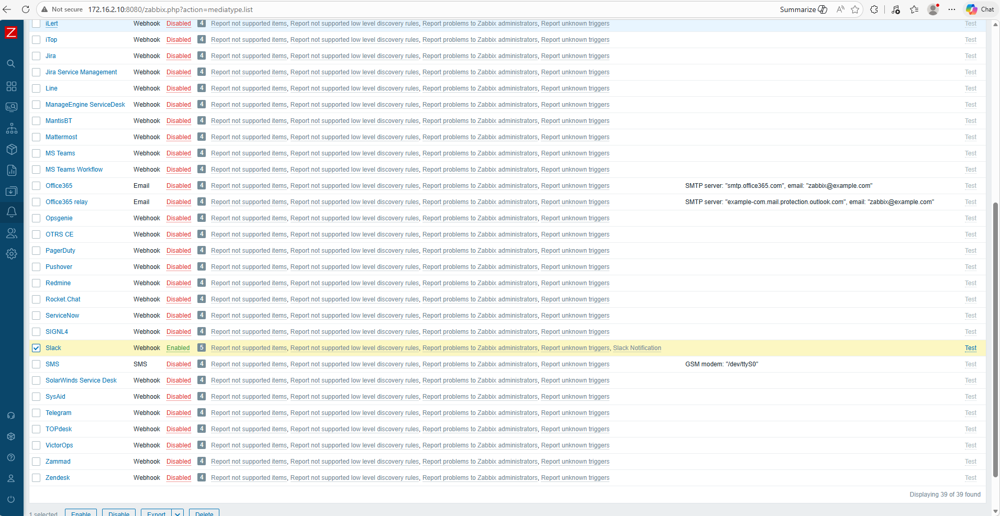
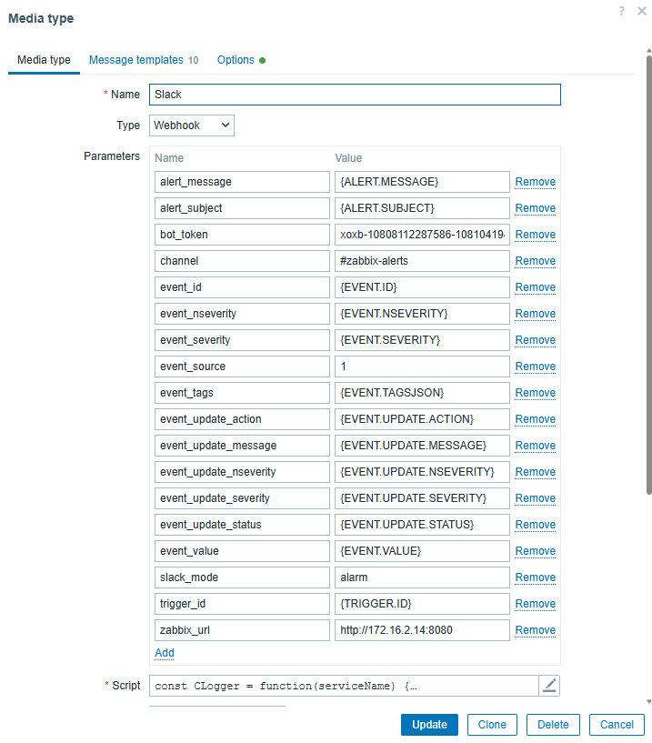
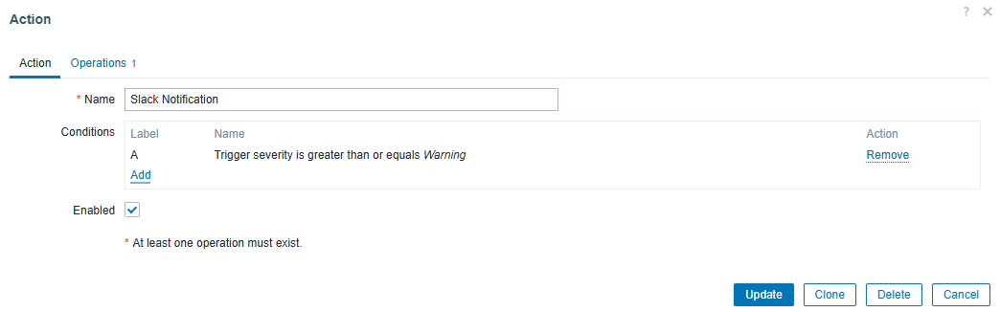
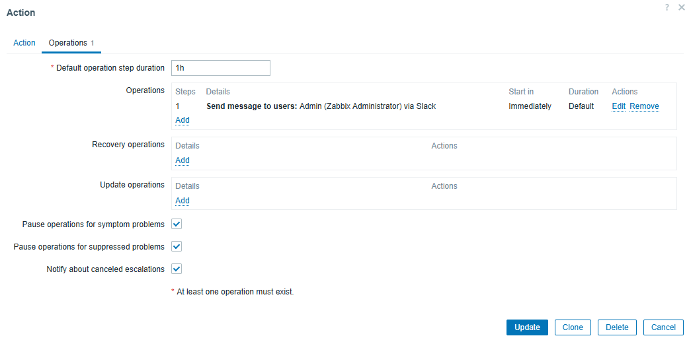

<h1>Setting up Slack Notification in Zabbix</h1>

This section covers integrating Zabbix with Slack so that alerts are sent directly to a dedicated Slack channel.

The integration uses Zabbix's Webhook media type, which sends formatted messages to Slack whenever a problem is detected
or resolved

Prerequisites
- A Slack workspace
- A dedicated channel in Slack workspace where Zabbix can send a message in it.
- Zabbix Server with internet access

<h1>Create a Slack App</h1>

The goal of creating a Slack App is to allow Zabbix to send a real-time notifications directly into a specific Slack channel. This channel should
exist inside your Slack Workspace.

  
  
Created Bot for Slack that can send messages on the channel using its API

When Zabbix sends a request to Slack, it uses its API to validate the bot token and it checks permissions, ensuring that it has chat:write permission and posts the message into the specified channel as the Zabbix Alerts bot.

  
  
Slack chat write permission for it allow post a message to the channel

  
  
Slack Bot OAuth Token which will be used by Zabbix to authenticate to Slack and get authorized to send the message to the Slack Workspace channel

<h1>Configure Media Type on Zabbix</h1>

Zabbix can be configured to send an alerts if there are issues that has been detected. It can use different Media Type
which includes Slack.

Configuring Slack on Zabbix can be found and navigated on Alerts > MediaType

  
  
Here we will see several media types that we can use. We will have to enable Slack and configure it

  
  
Slack Configurations

<h1>Create an Alert Trigger Action and Operation using User-based</h1>

After configuring Slack on the Media Type. We will create a Trigger Action. The Trigger Action tells Zabbix what to do when a trigger fires.
In Alerts > Trigger Actions, here we can create an Action and add a condition using Trigger Severity. This checks the severity level of the trigger

  
  
  
Action uses Trigger Severity and the condition is Greater than or Equal to Warning. This shows that once Zabbix detects a Warning level. It will
  Trigger this action and for the Operations, we need to specify which user will be the one to send a message to the Slack Workspace.

  
For this Lab, we can use the Zabbix Administrator but for best practice we can create a least privilege user

<h1>Result</h1>

  
  
Zabbix Alerts posts a Notification

