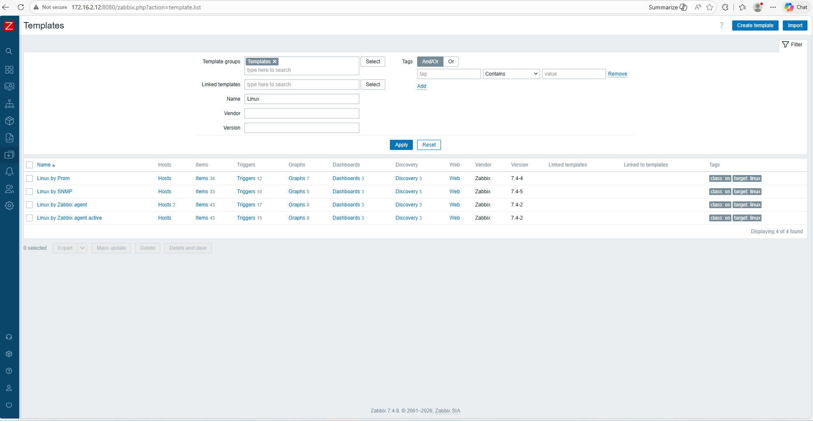
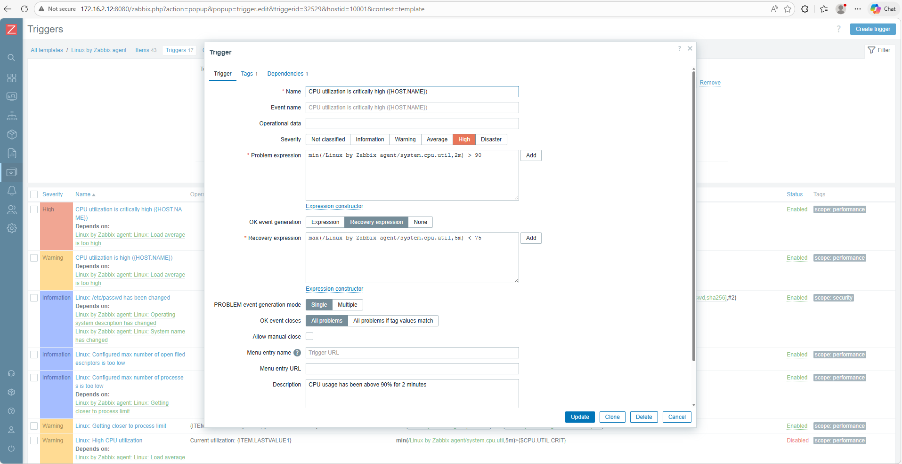
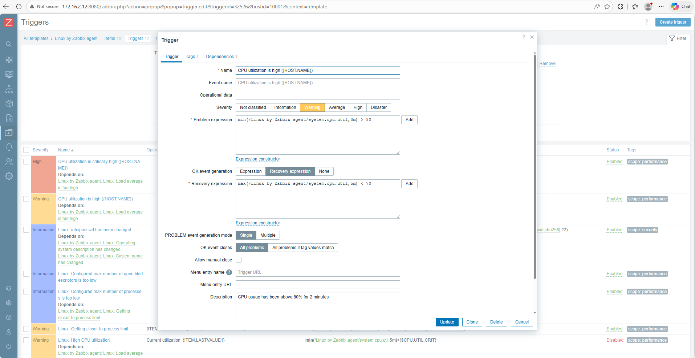
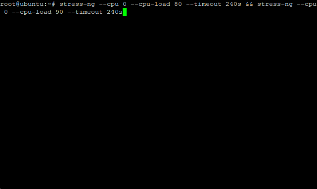

<h1>Customizing Zabbix CPU Util Alerts</h1>

<p>This section covers customizing the default CPU utilization triggers in the Linux by Zabbix agent 2 template so the alerts fire at the exact thresholds based on the preference</p>

<p>By default, Zabbix uses quite high values wherein 90% indicates a Warning severity. In this lab we configured the Template Trigger to provide an alert when:

- CPU usage reaches 80% Thresholds and marks as Warning. 
- If ever exceeds more than 90% of the Threshold, Zabbix will send another alert marking a High severity
</p>

<h3>1. On Zabbix, navigate to Data Collection > Templates and here we have to select Template groups. We will search for Linux by Zabbix Agent</h3>

<div align="center">
  
  <p>Data Collection Templates Filtering name "Linux"</p>
</div>

<p>By clicking the Trigger on a Template Row, we can see several pre-configured Alerts on it. </p>

<h3>2. Configure the Trigger on the Template</h3>

<div align="center">
  
  <p>Configuring CPU Utilization Alerts with Threshold of 90%</p>
</div>

<div align="center">
  
  <p>Configuring CPU Utilization Alerts with Threshold of 80%</p>
</div>

<h3>3. Run a Stress Test on the CPU Usage of Ubuntu Server (Zabbix Agent)</h3>

<p>After configuring the CPU Threshold, we ran some test on the Zabbix Agent. By simply installing stress-ng command, we can set a CPU usage to reach at 80% and exceeding at 90%. Each
time duration is 4 minutes.
</p>

<div align="center">
  
  <p>To test the alerts, we can simply run this command</p>
</div>

```bash
stress-ng --cpu 0 --cpu-load 80 --timeout 240s && stress-ng --cpu 0 --cpu-load 90 --timeout 240s
```

<p>The command indicates a stress test of CPU load on 80% in 4 minutes and another command execution to ran a test with a CPU load of 90$ within 4 minutes as well.
After running these commands on the Agent, here is the result on Zabbix Server.
</p>

<div align="center">
  
  <p>Zabbix High CPU alerted</p>
</div>
