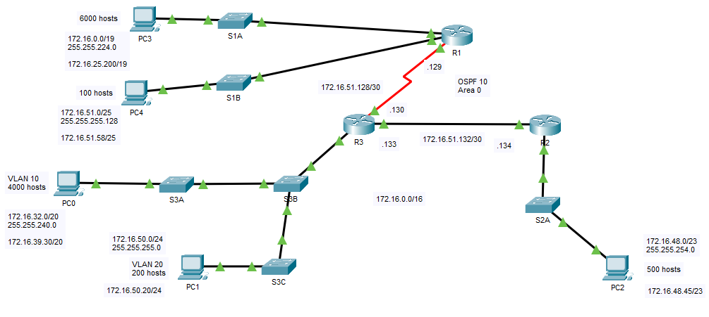
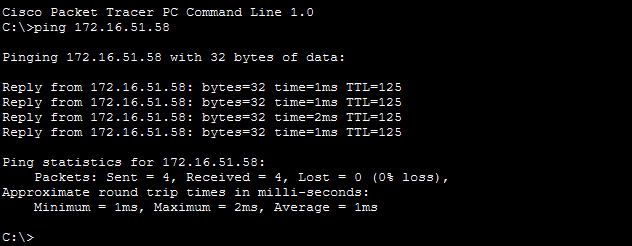
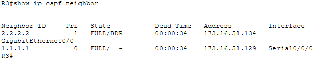
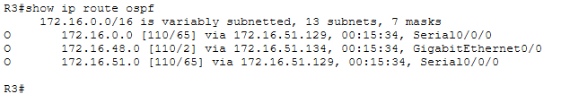
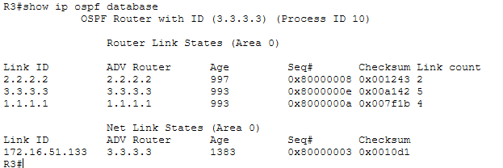

# Enterprise Network Design with VLSM, VLANs, DHCP and OSPF

Packet Tracer project demonstrating network segmentation through Variable Length Subnet Masking (VLSM), VLAN implementation, DHCP services, and Single-Area OSPF routing between Cisco routers.

---

## Overview

This project focuses on designing and implementing a scalable enterprise network using Cisco Packet Tracer. The network was segmented using Variable Length Subnet Masking (VLSM) to optimize IP address utilization while supporting multiple LANs, VLANs, and point-to-point links.

Three Cisco 1941 routers were configured to provide dynamic routing through OSPF Area 0, DHCP services for end devices, and inter-VLAN routing using Router-on-a-Stick architecture. Layer 2 segmentation was implemented through VLANs and trunk links across Cisco Catalyst switches.

The project demonstrates core networking concepts commonly used in enterprise environments including subnetting, VLAN design, dynamic routing, DHCP deployment, trunking, and routing verification.

---

## Main Components

- **Cisco 1941 ISR Routers**
  - Dynamic routing using OSPF Area 0
  - DHCP services for client networks
  - Router-on-a-Stick implementation for inter-VLAN routing

- **Cisco Catalyst 2960 Switches**
  - VLAN segmentation
  - Access and trunk port configurations
  - Layer 2 forwarding

- **OSPF Routing**
  - Neighbor adjacency establishment
  - Link-State Database synchronization
  - Dynamic route propagation

- **VLSM Addressing Scheme**
  - Efficient IP allocation
  - Reduced address wastage
  - Support for different host requirements
 
---

## Topology

  

The topology consists of three routers connected through routed links while servicing multiple LAN segments. VLAN 10 and VLAN 20 are implemented behind Router R3 using Router-on-a-Stick architecture. OSPF Area 0 provides dynamic route exchange between all routers, allowing full end-to-end connectivity across the network.

---

## Directories

| Section | Directory | Description | Link |
|----------|-----------|-------------|------|
| Configurations | `configs/` | Router and switch configurations used in the project | [View](configs/) |
| Images | `images/` | Network topology and verification screenshots | [View](images/) |
| Addressing Table | `tables/addressing-table.md` | IP addressing plan for all devices and interfaces | [View](tables/addressing-table.md) |
| Network Mapping | `tables/network-mapping.md` | Physical and logical device connectivity | [View](tables/network-mapping.md) |
| Subnetting Design | `tables/subnetting-network.md` | VLSM calculations and subnet allocations | [View](tables/subnetting-network.md) |
| Packet Tracer File | `pkt_file/` | Source Packet Tracer project | [View](pkt_file/) |

---

## Results

### End-to-End Connectivity

  
  
Successful communication between hosts across different subnets and VLANs.

### OSPF Neighbor Adjacency

  
  
OSPF routers successfully established neighbor relationships.

### OSPF Routing Table

  
  
Dynamic routes learned and installed through OSPF Area 0.

### OSPF Database Verification

  
  
Link-State Database synchronization across all OSPF routers.

---

## Key Features

- VLSM-based subnet allocation
- Dynamic routing with OSPF Area 0
- VLAN implementation and segmentation
- Router-on-a-Stick architecture
- DHCP services for automated host addressing
- Inter-VLAN communication
- OSPF neighbor adjacency verification
- End-to-end connectivity validation

---

## Learning Outcomes

- Designing scalable IP addressing schemes using VLSM
- Implementing OSPF dynamic routing in a multi-router environment
- Configuring VLANs and trunk links on Layer 2 switches
- Deploying Router-on-a-Stick for inter-VLAN routing
- Providing DHCP services to multiple network segments
- Verifying routing operation through routing tables, neighbor states, and LSDB inspection
- Troubleshooting connectivity between segmented networks

---

## Conclusion

This project successfully demonstrates the deployment of an enterprise-style network utilizing VLSM for efficient IP address management and OSPF for dynamic route exchange. Through VLAN segmentation, DHCP services, and inter-VLAN routing, all devices were able to communicate across multiple network segments while maintaining an organized and scalable network design.

The implementation validates fundamental CCNA and entry-level network engineering concepts commonly encountered in production environments.
