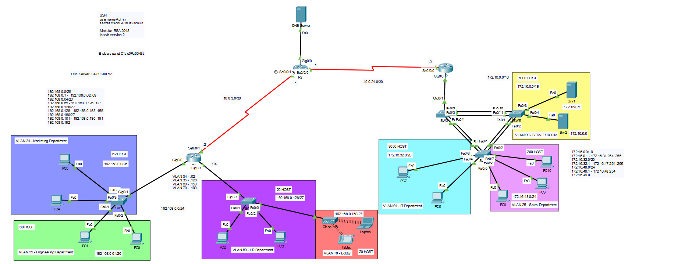
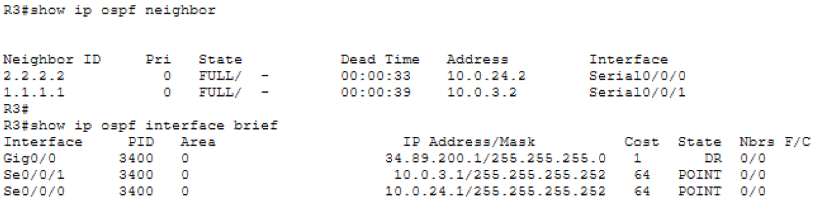
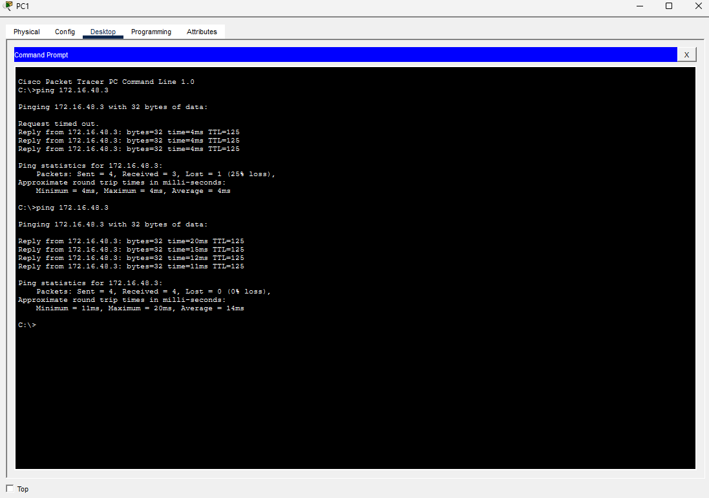

# Enterprise Network Design using VLSM, Inter-VLAN Routing, OSPF, EtherChannel, and Network Hardening

Packet Tracer project demonstrating enterprise network segmentation using VLSM, Router-on-a-Stick inter-VLAN routing, authenticated OSPF routing, EtherChannel redundancy, STP optimization, and network security hardening.

---

## Overview

This project focuses on designing and implementing a secure and resilient enterprise network infrastructure using Cisco routers and switches. The network was segmented using Variable Length Subnet Masking (VLSM) to efficiently allocate IP addresses across departments with varying host requirements.

Router-on-a-Stick was implemented to provide Inter-VLAN communication while maintaining logical separation between departments. Dynamic routing was achieved using OSPF Area 0 with MD5 authentication to secure routing adjacencies. High availability was enhanced through PAgP EtherChannel and Spanning Tree root bridge optimization.

Additional security measures such as SSHv2 management access, BPDU Guard, PortFast, and Sticky MAC Port Security were deployed to protect both the management and access layers of the network.

---

## Main Components

### Cisco 1941 ISR Routers

- OSPF Area 0 Dynamic Routing
- MD5 OSPF Authentication
- DHCP Services
- Router-on-a-Stick Inter-VLAN Routing
- SSHv2 Remote Management

### Cisco Catalyst 2960 Switches

- VLAN Segmentation
- 802.1Q Trunking
- PAgP EtherChannel
- Rapid Spanning Tree Protocol (RSTP)
- Port Security
- BPDU Guard and PortFast
- SSHv2 Remote Management

### Dynamic Routing

- Single Area OSPF
- MD5 Message Digest Authentication
- Passive Interface Configuration
- Dynamic Route Advertisement

### High Availability

- EtherChannel Link Aggregation
- Primary and Secondary STP Root Bridges
- Redundant Layer 2 Paths
- Loop Prevention

---

## Topology

  

The topology consists of three Cisco routers interconnected through serial WAN links and multiple Layer 2 switching domains. VLANs are deployed to separate departments while Router-on-a-Stick provides controlled communication between VLANs.

OSPF Area 0 dynamically exchanges routing information between routers while EtherChannel bundles multiple switch uplinks to provide redundancy and increased bandwidth. Security controls are enforced throughout the network to protect both access and management planes.

---

## Directories

| Section | Directory | Description | Link |
|----------|-----------|-------------|------|
| Configurations | `configs/` | Cisco devices configurations | [View](configs/) |
| Images | `images/` | Network topology and verification screenshots | [View](images/) |
| Addressing Table | `tables/addressing-table.md` | Complete IP addressing scheme | [View](tables/addressing-table.md) |
| Network Mapping | `tables/network-mapping.md` | Physical and logical device connectivity | [View](tables/network-mapping.md) |
| Subnetting Network | `tables/subnetting-network.md` | VLSM calculations and subnet allocations | [View](tables/subnetting-network.md) |
| Packet Tracer File | `pkt_file/` | Source Packet Tracer project | [View](pkt_file/) |

---

## Results

### OSPF Neighbor Adjacencies and Interface

  
  
Dynamic routes learned and installed through OSPF Area 0.

### End-to-End Connectivity

  
  
Successful communication between hosts located in different VLANs and network segments.

---

## Key Features

- Variable Length Subnet Masking (VLSM)
- Router-on-a-Stick Inter-VLAN Routing
- Dynamic Routing using OSPF Area 0
- MD5 OSPF Authentication
- DHCP Address Distribution
- VLAN Segmentation
- PAgP EtherChannel
- STP Root Bridge Optimization
- SSHv2 Secure Management
- Sticky MAC Port Security
- BPDU Guard Protection
- Passive OSPF Interfaces
- Redundant Layer 2 Design

---

## Learning Outcomes

- Design scalable enterprise IP addressing plans using VLSM
- Deploy secure OSPF routing with MD5 authentication
- Implement Inter-VLAN communication through Router-on-a-Stick
- Configure DHCP services across multiple networks
- Build redundant Layer 2 infrastructures using EtherChannel
- Optimize Spanning Tree topology through root bridge election
- Secure access-layer ports using Port Security and BPDU Guard
- Secure device administration using SSHv2
- Verify routing operations and end-to-end connectivity
- Troubleshoot enterprise switching and routing environments

---

## Conclusion

This project successfully demonstrates the implementation of a secure and scalable enterprise network utilizing VLSM, Inter-VLAN Routing, OSPF, EtherChannel, and multiple network hardening techniques.

The deployment validated neighbor adjacency establishment, route propagation, VLAN isolation, secure management access, DHCP automation, and high-availability Layer 2 design. By integrating routing, switching, redundancy, and security best practices, the resulting architecture closely resembles enterprise networking environments encountered in production infrastructures.
