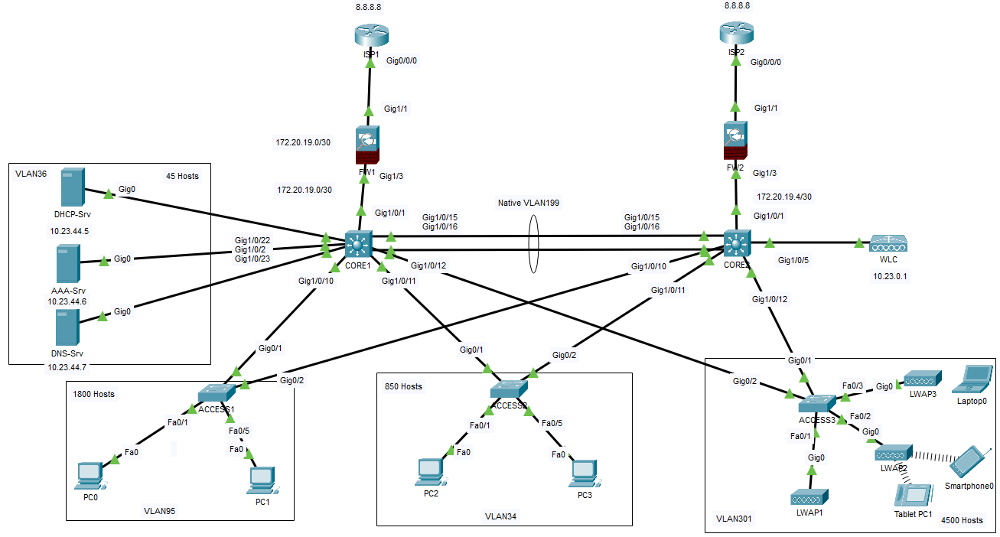
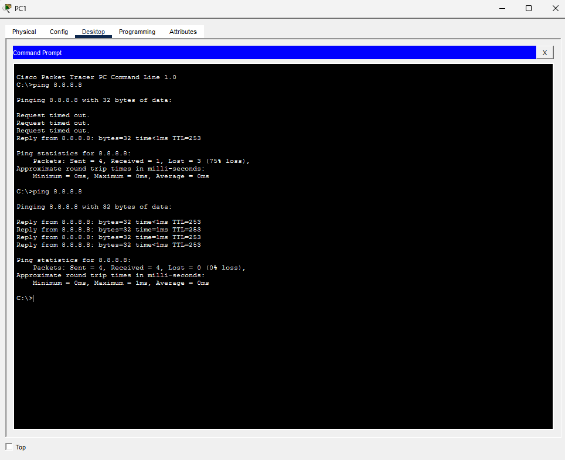
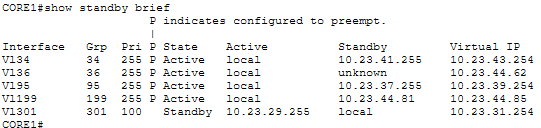
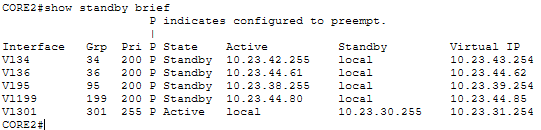
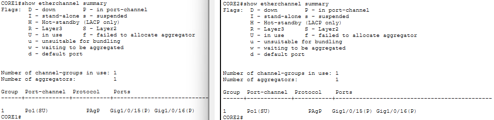
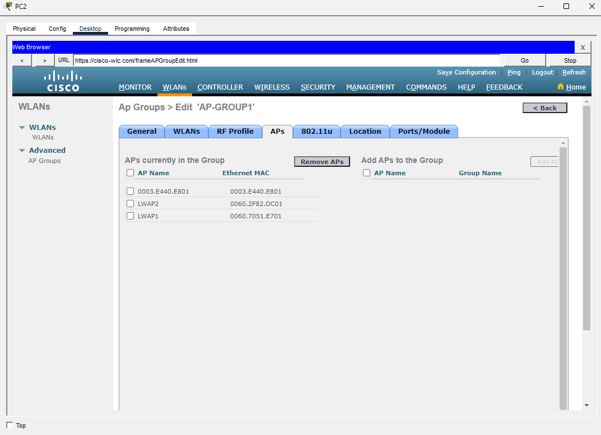
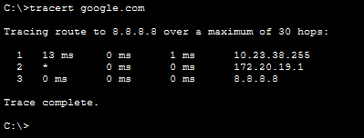
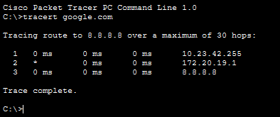
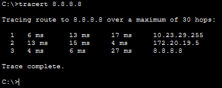
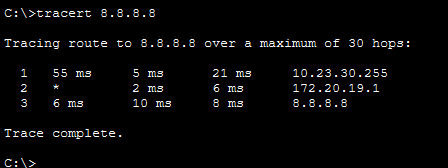

# High Availability Secured Enterprise Campus Network

Packet Tracer project demonstrating a highly available enterprise campus architecture utilizing dual ISP connectivity, redundant firewalls, HSRP gateway failover, EtherChannel uplinks, wireless infrastructure, centralized network services, and Layer 2 redundancy mechanisms.

---

## Overview

This project focuses on designing and implementing a highly available and secure enterprise campus network using Cisco enterprise technologies. The architecture was built to eliminate single points of failure while maintaining reliable connectivity for wired and wireless users.

High availability was achieved through dual ISP connectivity, redundant Cisco ASA firewalls, HSRP gateway redundancy, EtherChannel link aggregation, and Rapid-PVST+ convergence mechanisms. Wireless services were centralized through a Wireless LAN Controller (WLC) managing Lightweight Access Points (LWAPs), while DHCP, DNS, and AAA services were deployed to provide essential enterprise network services.

The resulting design closely resembles modern campus infrastructures that require resiliency, scalability, and centralized management.

---

## Main Components

### Cisco ASA Firewalls

- Dual Internet Edge Connectivity
- NAT/PAT Translation
- Security Boundary Enforcement
- Redundant WAN Connectivity

### Cisco Catalyst 3650 Multilayer Switches

- HSRP Gateway Redundancy
- Inter-VLAN Routing
- EtherChannel Aggregation
- Rapid-PVST+ Root Bridge Control

### Cisco Catalyst 2960 Access Switches

- VLAN Segmentation
- Access Layer Connectivity
- Trunk Uplinks
- Redundant Switch Paths

### Wireless Infrastructure

- Wireless LAN Controller (WLC)
- Lightweight Access Points (LWAPs)
- Centralized WLAN Management
- Enterprise Wireless Connectivity

### Network Services

- DHCP Server
- DNS Server
- AAA (RADIUS) Server
- Centralized Authentication Services

---

## Topology

  

The topology follows a hierarchical campus design consisting of internet edge devices, redundant firewall infrastructure, multilayer core switches, access switches, wireless infrastructure, and centralized server services.

HSRP provides default gateway redundancy for all VLANs, while EtherChannel and Rapid-PVST+ ensure continuous Layer 2 connectivity during link or device failures. Wireless users authenticate through centralized AAA services and receive network access through the Wireless LAN Controller architecture.

---

## Directories

| Section | Directory | Description | Link |
|----------|-----------|-------------|------|
| Configurations | `configs/` | Cisco devices and infrastructure service configurations | [View](configs/) |
| Images | `images/` | Network topology and verification screenshots | [View](images/) |
| Addressing Table | `tables/addressing-table.md` | Complete IP addressing scheme | [View](tables/addressing-table.md) |
| Network Mapping | `tables/network-mapping.md` | Physical and logical device connectivity | [View](tables/network-mapping.md) |
| Subnetting Network | `tables/subnetting-network.md` | VLSM calculations and subnet allocations | [View](tables/subnetting-network.md) |
| Packet Tracer File | `pkt_file/` | Source Packet Tracer project | [View](pkt_file/) |

---

## Results

### Ping Test Connectivity

  
  
Successful communication to external destinations.

### HSRP Gateway Redundancy

  

  
  
HSRP successfully provided gateway redundancy and automatic failover between multilayer core switches.

### EtherChannel Verification

  
  
EtherChannel successfully aggregated multiple physical links into resilient logical uplinks.

### Wireless Infrastructure Verification

  
  
Lightweight Access Points successfully registered with the Wireless LAN Controller and provided wireless connectivity.

### Failover Testing

  
  
  
  
  
Network services remained operational during simulated uplink and infrastructure failures through HSRP and Rapid-PVST+ convergence.

---

## Key Features

- Dual ISP Connectivity
- Cisco ASA Firewall Integration
- HSRP Gateway Redundancy
- EtherChannel Link Aggregation
- Rapid-PVST+ Convergence
- Inter-VLAN Routing
- VLAN Segmentation
- Wireless LAN Controller Deployment
- Lightweight Access Points
- DHCP Services
- DNS Services
- AAA (RADIUS) Authentication
- Hierarchical Campus Design
- High Availability Architecture

---

## Learning Outcomes

- Design highly available campus network architectures
- Implement HSRP gateway redundancy
- Configure EtherChannel for bandwidth aggregation and resiliency
- Deploy Rapid-PVST+ for Layer 2 loop prevention and convergence
- Configure centralized wireless infrastructures using WLC and LWAPs
- Deploy enterprise services such as DHCP, DNS, and AAA
- Implement dual WAN connectivity through firewall infrastructures
- Verify failover scenarios and network resiliency
- Troubleshoot campus switching and routing environments
- Design scalable enterprise network topologies

---

## Conclusion

This project successfully demonstrates the implementation of a highly available and secure enterprise campus network utilizing redundant internet connectivity, firewall security, HSRP gateway failover, EtherChannel aggregation, wireless infrastructure, and centralized network services.

The deployment validated gateway redundancy, wireless authentication services, Layer 2 resiliency, server accessibility, and failover recovery mechanisms. By integrating redundancy, security, centralized management, and enterprise service delivery, the resulting architecture closely resembles production campus network environments commonly deployed within modern organizations.
