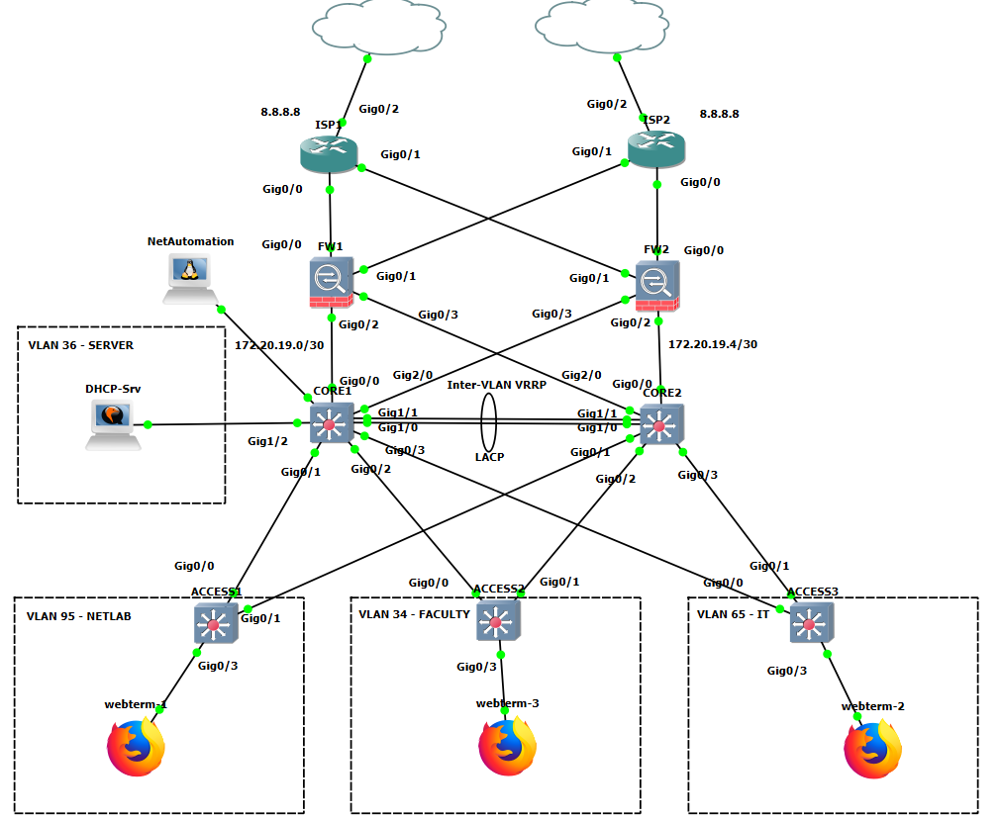
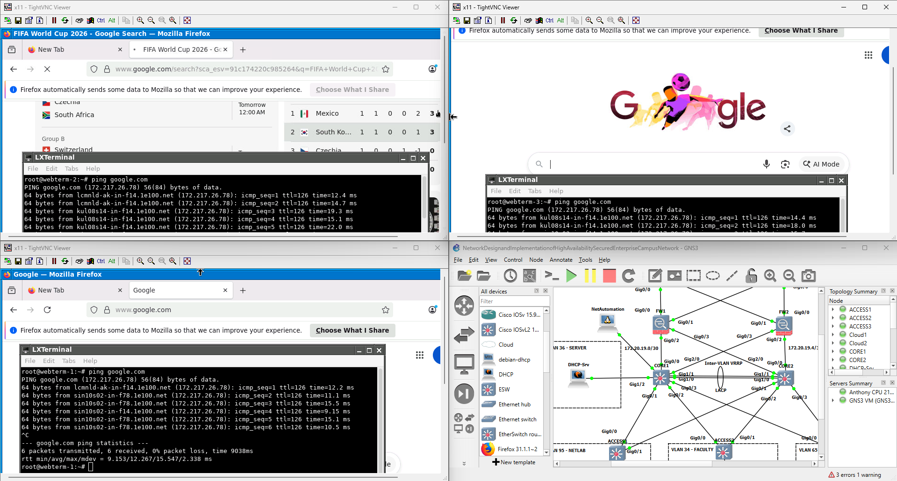
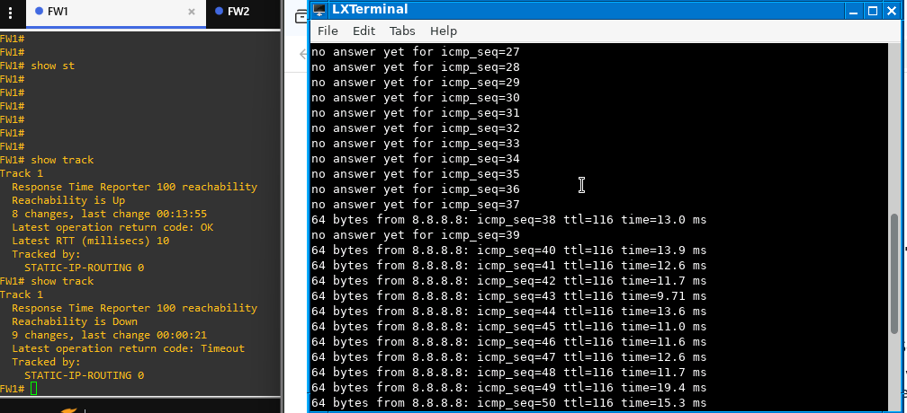
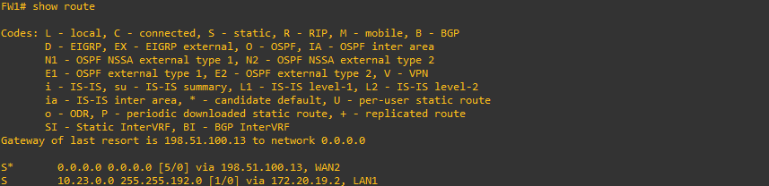

# Securing Campus Network Infrastructure with High Availability and Network Automation using Python Netmiko

GNS3 project demonstrating enterprise campus network design through VLAN segmentation, VRRP gateway redundancy, LACP EtherChannel, centralized DHCP services, Cisco ASAv Dual-WAN failover, and Python Netmiko-based network automation.

---

## Overview

This project focuses on designing and implementing a secure and highly available campus network infrastructure within a GNS3 virtual environment. The network follows a Two-Tier Architecture consisting of redundant Core and Access Layers protected by Cisco ASAv firewalls acting as the security perimeter.

The implementation combines traditional enterprise networking concepts with modern network automation practices. High availability is achieved through VRRP virtual gateways, LACP EtherChannel redundancy, and Dual-WAN failover utilizing Cisco ASA SLA monitoring. Centralized DHCP services provide dynamic address allocation across multiple VLANs while Python Netmiko is leveraged to automate configuration management through SSH.

The project demonstrates real-world enterprise networking concepts including network segmentation, fault tolerance, firewall security, redundancy design, and infrastructure automation.

---

## Main Components

- **Cisco ASAv Firewalls**
  - Stateful Packet Inspection (SPI)
  - Dynamic NAT/PAT
  - Dual-WAN Failover
  - SLA Monitoring

- **Cisco vIOS-L2 Core Switches**
  - Inter-VLAN Routing
  - VRRP Gateway Redundancy
  - LACP EtherChannel
  - Rapid PVST+

- **Cisco vIOS-L2 Access Switches**
  - VLAN Segmentation
  - Port Security
  - BPDU Guard
  - Access Layer Connectivity

- **Linux Debian DHCP Server**
  - Centralized DHCP Services
  - Multiple DHCP Scopes
  - Dynamic Host Assignment

- **Python Netmiko Automation**
  - SSH-Based Device Management
  - Automated Configuration Deployment
  - Configuration Verification

---

## Topology

  

The topology consists of dual ISP routers connected to redundant Cisco ASAv firewalls acting as the enterprise security perimeter. The firewalls connect to redundant Core Layer switches that provide Inter-VLAN Routing and VRRP gateway redundancy. Access Layer switches connect endpoint devices across multiple VLANs while centralized DHCP services provide automatic IP address assignment. A dedicated Network Automation node utilizes Python Netmiko to remotely manage network devices through SSH.

---

## Directories

| Section | Directory | Description | Link |
|----------|-----------|-------------|------|
| Configurations | `configs/` | Cisco router, firewall, and switch configurations | [View](configs/) |
| Network Automation | `configs/netmiko-python/` | Python Netmiko automation resources and configurations | [View](configs/netmiko-python/) |
| Images | `images/` | Topology diagrams and validation screenshots | [View](images/) |
| Tables | `tables/` | Addressing plans, subnetting design, and network documentation | [View](tables/) |

---

## Results

### End-to-End Connectivity

  
  
Successful communication between internal VLANs and external internet destinations.

### Dual-WAN Failover Validation

  
  
SLA monitoring successfully detected WAN failure and transitioned traffic to the backup ISP.

### Automatic Route Switchover

  
  
Firewall routing table automatically updated to use the secondary WAN path during failover events.

### Firewall NAT and Stateful Inspection

- Internal hosts successfully translated through Dynamic NAT/PAT.
- Cisco ASAv tracked active TCP, UDP, and ICMP sessions.
- Return traffic was automatically permitted through Stateful Packet Inspection.

### DHCP Services

- End devices successfully received addresses from centralized DHCP scopes.
- DHCP relay functionality provided address assignment across multiple VLANs.

---

## Key Features

- Two-Tier Campus Network Architecture
- VLAN Segmentation and Network Isolation
- Inter-VLAN Routing
- VRRP Gateway Redundancy
- LACP EtherChannel Redundant Links
- Cisco ASAv Stateful Firewall
- Dynamic NAT/PAT
- Dual-WAN Failover using SLA Monitoring
- Rapid PVST+ Spanning Tree Optimization
- Centralized DHCP Services
- SSHv2 Secure Device Management
- Python Netmiko Network Automation

---

## Learning Outcomes

- Designing enterprise campus network architectures
- Implementing VLAN segmentation and traffic isolation
- Configuring Inter-VLAN Routing on multilayer switches
- Deploying VRRP for gateway redundancy
- Building redundant Layer 2 links using LACP EtherChannel
- Implementing Cisco ASAv firewalls with NAT/PAT and Stateful Inspection
- Designing Dual-WAN failover solutions using SLA tracking
- Configuring DHCP relay and centralized DHCP services
- Securing network infrastructure through SSH, Port Security, and BPDU Guard
- Automating network management using Python Netmiko
- Troubleshooting high-availability and failover scenarios

---

## Conclusion

This project successfully demonstrates the implementation of a secure, scalable, and highly available enterprise campus network utilizing Cisco technologies and Python-based network automation. Through the integration of VRRP, LACP EtherChannel, centralized DHCP services, and Cisco ASAv Dual-WAN failover, the infrastructure provides resilience against device and link failures while maintaining continuous network operations.

Additionally, Python Netmiko automation showcases how network engineers can streamline configuration management and reduce manual administrative effort through programmatic device interaction. The project serves as a practical reference for students, network engineers, and cybersecurity professionals seeking hands-on experience in enterprise networking, high availability, firewall deployment, and network automation within GNS3 environments.
