# Windows Server 2022 - Active Directory Enterprise Lab

This project documents the design, setup, configuration, and validation of an enterprise-style Active Directory environment using Windows Server 2022.

The objective of this lab is to understand **identity management, authentication, authorization, and access control** in a Windows domain, following real-world enterprise practices rather than single-server or shortcut configurations.

## Environment

- Hypervisor: Proxmox
- Domain Controller: Windows Server 2022
- File Server: Windows Server 2022
- Client: Windows 10 / Windows 11

## Network Assumptions

- All servers and clients reside on the same internal network
- Static IP addresses assigned to servers
- DNS services provided by the Domain Controller

## Architecture Overview

The environment is composed of three main roles:

- WinServer-DomainController – Domain Controller (AD DS + DNS)
- WinServer-FileServer – File Server (NTFS + SMB shares)
- Win10-HR01 – Domain-joined workstation

Each role is separated into its own virtual machine to mirror enterprise best practices and enforce separation of concerns.

## Phase 1 – Server & Network Foundation

- Installed Windows Server 2022 on Proxmox

  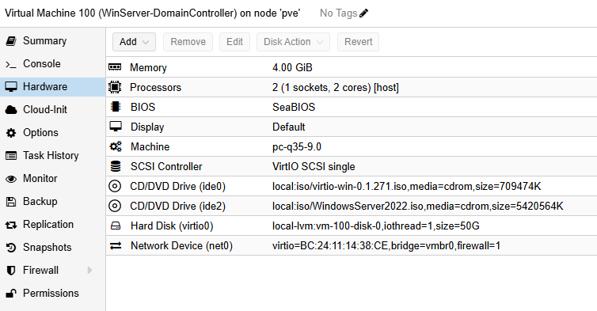

  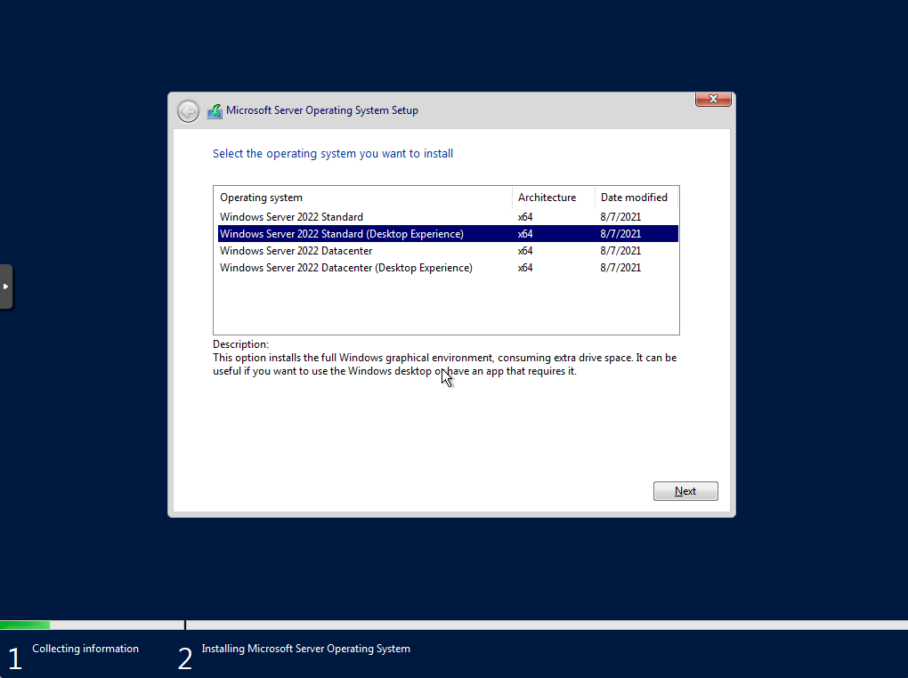

  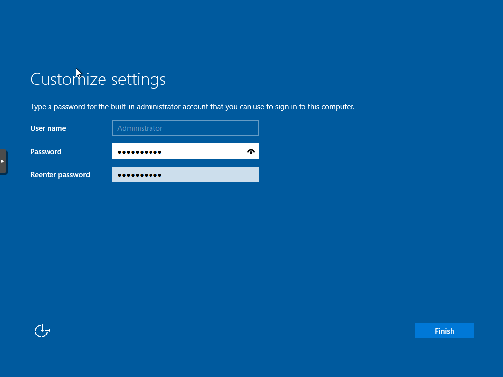

- Configured static IP addressing
- Set DNS to point to the Domain Controller

  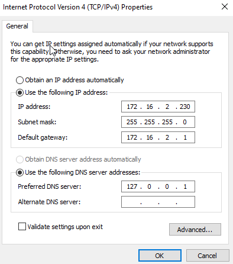

- Renamed servers following role-based naming conventions

  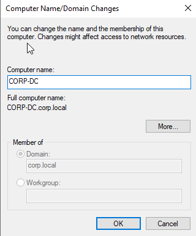

## Phase 2 – Active Directory Domain Services

- Installed Active Directory Domain Services (AD DS)
- Promoted DC01 to a Domain Controller
- Created a new domain: corp.local
- Verified DNS integration and domain health

  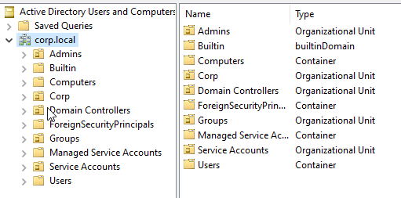

This phase established centralized authentication and directory services for the environment.

## Phase 3 – Users, Groups & Organizational Units

An enterprise-style OU structure was implemented to separate users, computers, and administrative objects.

### Organizational Units
- Corp
  - Departments
    - IT
    - HR
    - Finance
  - Groups
    - Global
    - DomainLocal

### Group Strategy
- Global Groups were created to represent roles and identities
- Domain Local Groups were created to represent resource access
- Group nesting followed the AGDLP model

  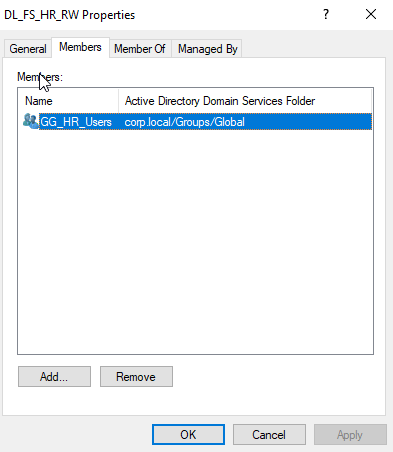

## Phase 5 – File Server & NTFS Permissions

- Deployed a dedicated File Server (WinServer-FileServer)
- Joined FileServer to the domain
- Created a structured data directory (F:\Shares\Departments)

  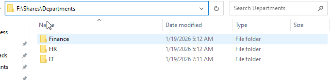

- Configured NTFS permissions using Domain Local Groups
- Used Global Groups for identity-based access
- Enabled Access-Based Enumeration

  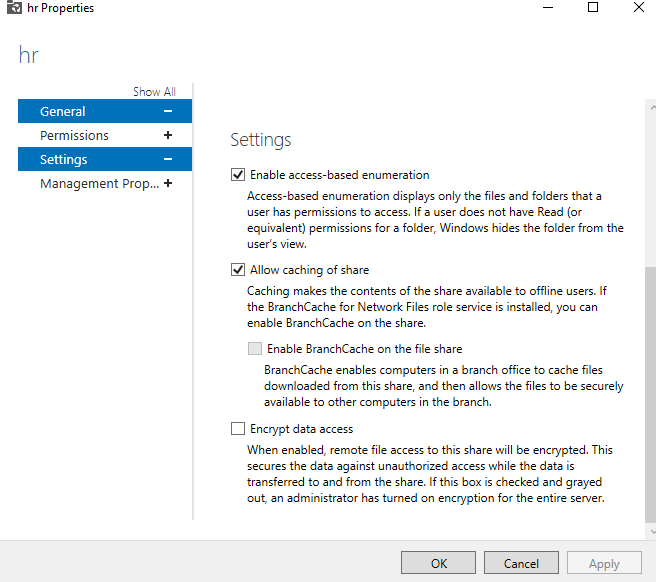

Permissions were never assigned directly to users.

## Phase 6 – Domain-Joined Client

- Joined Windows 10/11 client to the domain
- Logged in using domain user accounts
- Verified access control to file shares
- Confirmed correct permission enforcement per department

## Testing and Validation

- Verified domain authentication from client machines
- Confirmed access-based restrictions between departments
- Tested read/write permissions per group
- Ensured unauthorized access was denied

  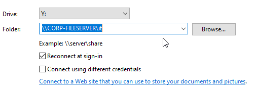

  

  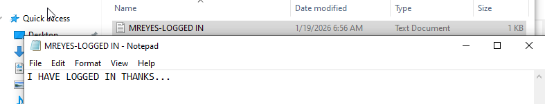

  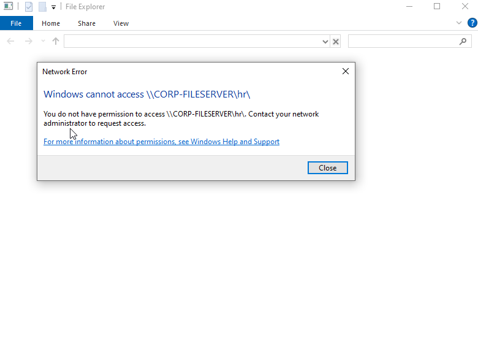

All access decisions were validated using group membership rather than direct user permissions.

## Lessons Learned

- Active Directory is fundamentally about identity and trust
- DNS is critical to domain functionality
- Group design matters more than folder permissions
- Global Groups and Domain Local Groups exist for scalability and security
- Enterprise environments prioritize clarity, auditability, and change safety

## Why This Project Matters

This lab reflects real-world enterprise practices rather than simplified home lab setups.  
It demonstrates understanding of:

- Identity and access management
- Role-based access control (RBAC)
- Secure Windows infrastructure design
- Enterprise Active Directory fundamentals
