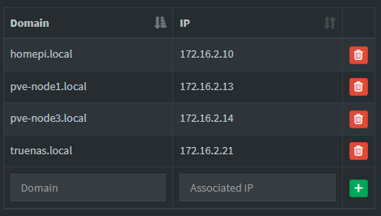

# Proxmox LXC Container with Nginx Configuration Documentation

## Overview

This document provides detailed instructions on how to set up a Proxmox Linux container with Nginx, including configuration changes, troubleshooting common issues, and verifying results. The purpose of this documentation is to ensure that the setup can be easily reproduced and maintained.

## Objective

The objective of this project is to configure a Proxmox LXC container with Nginx to handle both HTTP and WebSocket requests from clients. This setup involves creating an LXC container, installing necessary packages, configuring Nginx, and troubleshooting any issues that may arise during the process.

## Results

###Nginx Server Block in `sites-available` Directory###

  
  
 .

###Pi-hole DNS Resolver###

  
  
 .

###Accessing TrueNAS via Nginx###

  
  
 .

## Learning Outcome

- Install and Configure Nginx within the LXC container by modifying server blocks and proxy settings.
- Troubleshoot HTTP Websocket and request route issues during configuration.
- Verify the setup by testing HTTP and WebSocket connections.

## Conclusion

This project successfully demonstrates how to set up a Proxmox LXC container with Nginx, allowing it to handle both HTTP and WebSocket requests. By following these instructions, you can easily replicate and maintain this setup for future reference or deployment needs. If you encounter any issues during the process, feel free to ask for assistance.
