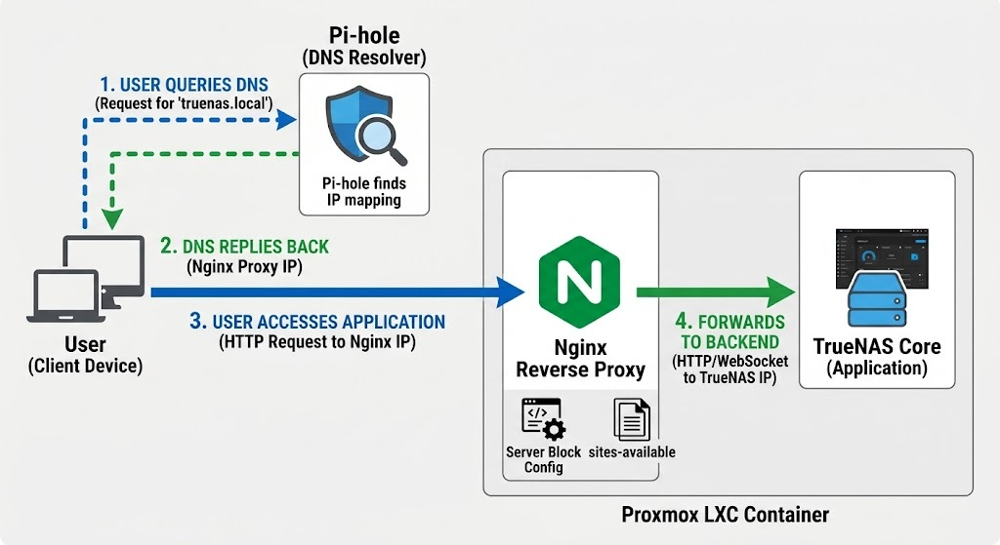
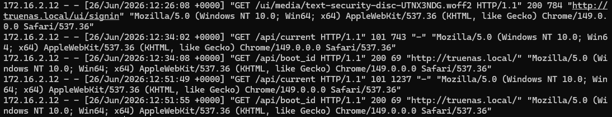
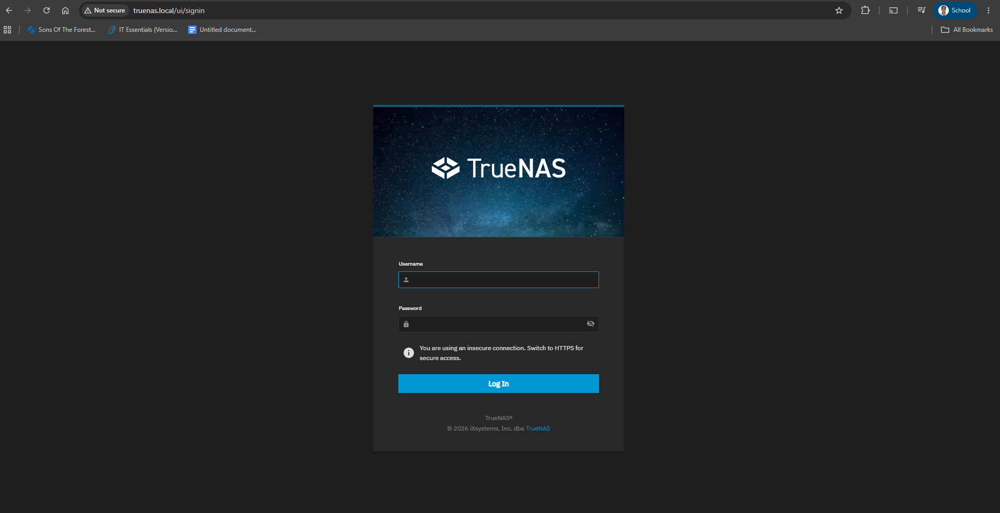

# Local Reverse Proxy Setup: Nginx on Proxmox LXC for TrueNAS

## Overview

This project details the implementation of an Nginx Reverse Proxy hosted within a Proxmox LXC (Linux Container). The setup leverages Pi-hole DNS to map a custom domain name to Nginx, which then securely routes client HTTP and WebSocket traffic to a backend TrueNAS core application. This documentation serves as a deployment and troubleshooting guide to ensure the architecture is easily reproducible and maintainable.

## Objective

The primary objective is to establish a centralized, efficient gateway for homelab services by configuring Nginx to act as a reverse proxy for TrueNAS. 

To achieve this, the project involves:
* Deploying a lightweight **Proxmox LXC container** to host the Nginx service.
* Configuring **Nginx Server Blocks** to handle both standard HTTP requests and persistent WebSocket connections required by modern web UIs like TrueNAS.
* Integrating **Pi-hole DNS** to seamlessly resolve local domain queries to the proxy rather than exposing direct backend IP addresses.

## Main Components
- **Proxmox VE**: Type 1 Hypervisor used to create Virtual Machines and Linux Containers.
- **Nginx**: Installed on the LXC container to handle HTTP requests efficiently. This handles all HTTP Requests customized from a server block in `sites-available` to manage both static and dynamic content based on client requests.
- **Pi-Hole DNS**: DNS Resolver which was used to map domain name of TrueNAS to the Reverse Proxy (Nginx)
- **Server Block Configuration**: By editing server blocks, This was used to define routes that could handle different types of requests, ensuring smooth performance for clients.

## Traffic Flow Architecture

  
  
Step-by-step Traffic flow architecture.

<ol>
  <li><strong>User Initiates Request:</strong> The user enters the custom domain name (e.g., <code>truenas.local</code>) into their web browser.</li>
  <li><strong>DNS Query to Pi-hole:</strong> The user's device sends a DNS query to the Pi-hole DNS resolver to look up the IP address for that domain.</li>
  <li><strong>DNS Resolution & Reply:</strong> Pi-hole checks its local DNS records, finds the mapping, and replies to the user's device with the IP address of the Nginx LXC container.</li>
  <li><strong>HTTP/WebSocket Connection:</strong> Armed with the correct IP, the user's device bypasses Pi-hole and sends the actual HTTP or WebSocket web request directly to the Nginx Reverse Proxy.</li>
  <li><strong>Server Block Evaluation:</strong> Nginx receives the request, matches the host header against its <code>sites-available</code> server block configurations, and identifies the backend destination.</li>
  <li><strong>Forwarding to Backend:</strong> Nginx forwards the traffic to the destination TrueNAS Core application IP, serving the interface back to the user seamlessly.</li>
</ol>

## Results

### Nginx Access Logs

  
  
Nginx logs confirming HTTP requests can access TrueNAS.

### Accessing TrueNAS via Nginx

  
  
Accessing TrueNAS through Nginx reverse proxy.

## Learning Outcome

- Configuring Nginx as Reverse Proxy allows it to act as a gateway access to the Applications behind it.
- Specifying the server name for Nginx is important because this allows the it to forward/route the HTTP Request from the client endpoint to the Server.
- DNS Resolver helped redirecting the client requests by mapping TrueNAS's domain name to the IP address of Nginx, and when Nginx receives the HTTP Request it checks on its sites-available what is the IP address of TrueNAS

## Conclusion

This project successfully demonstrates how to set up a Proxmox LXC container with Nginx, allowing it to handle both HTTP and WebSocket requests. By following these instructions, you can easily replicate and maintain this setup for future reference or deployment needs. If you encounter any issues during the process, feel free to ask for assistance.
