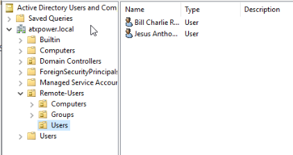
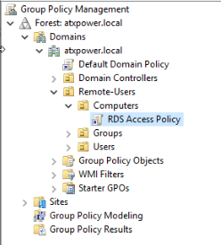
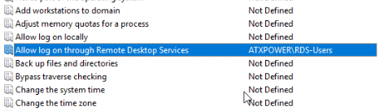
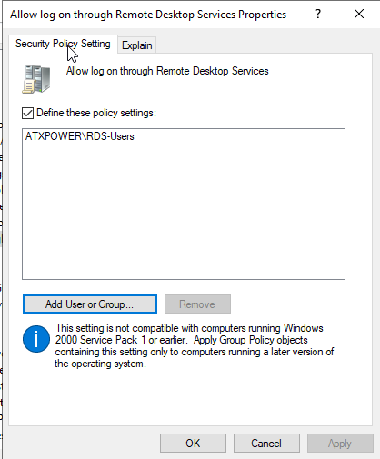
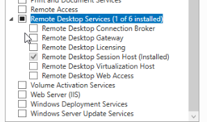
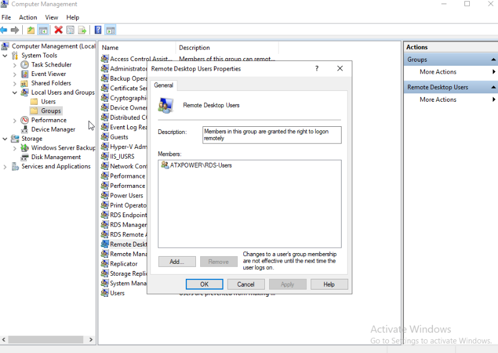
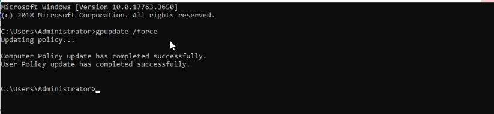
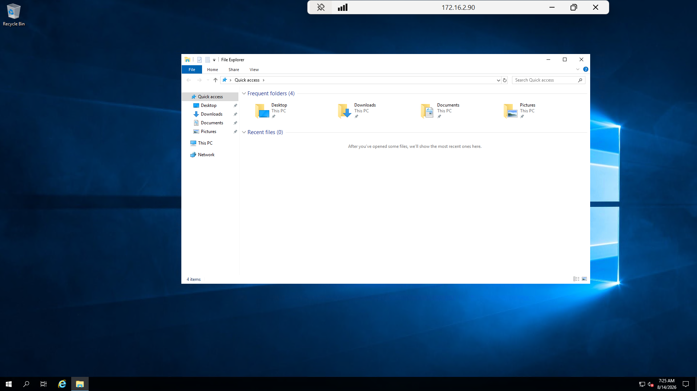
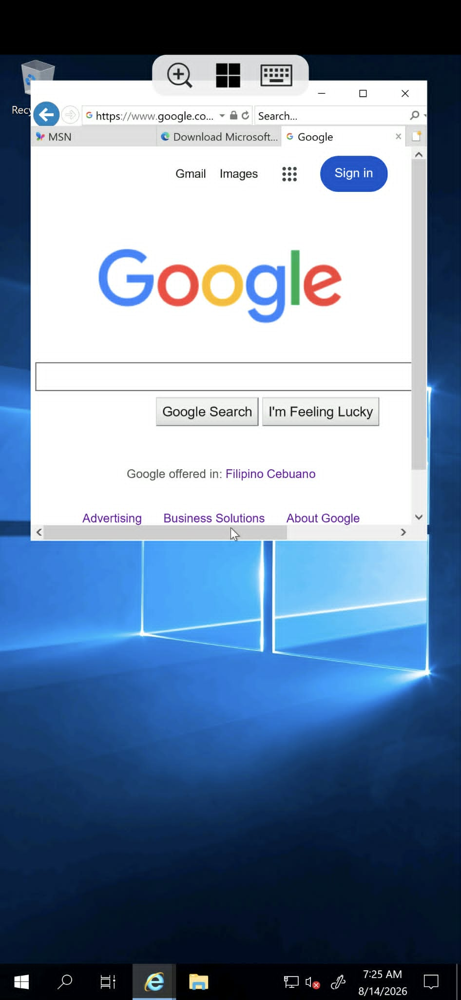

# RDS Server Installation Setup - with Multiple User connection

## Purpose:
- To setup a Single RDS Server that handles multiple clients remote access
- Create Users and add them as Member of a created RDS Group from a Centralized Active Directory
- Authorize users to connect on a RDS Server using the created users from Active Directory Server.
- Verify whether the users have different Remote Desktop session and not having identical perspective view and no interruption of mouse and keyboard interaction.

---

### Phase 1: Identify the Requirements
- **Virtual Machines**
  - AD-Srv
  - RDS-Srv
- **Operating System: Windows Server 2019**
- **Active Directory Users and Computers**
  - OU: Remote-Users
  - Users (Atleast 2)
  - Group: RDS-Users
  - Computers: Domain-Joined RDS-Srv
- **Group Policy Object**
  - Allow log on through Remote Desktop Services
 
### Phase 2: Setup Active Directory Server and Create Users
1. Install **Active Directory Domain Services**
2. After Installation go to **Tools > Active Directory Users and Computers**
3. Create **Organizational Unit** (Optional)
4. Under Organizational Unit create the following
  - Users
  - Groups
  - Computers

Users must be MemberOf to RDS-Users group that we created. We will use this group to authorize users that are member of that group to allow accessing RDS-Srv remotely using RDP.

<div align="center">
  
  <p>Created Users will be used when accessing RDP-Srv remotely</p>
</div>

### Phase 3: Create a Group Policy Object
1. Create a Group Policy Object, go to **Tools > Group Policy Management**
2. Expand all parent directories, on Computers OU and create a GPO under it.

<div align="center">
  
  <p>Created RDS Access Policy GPO under Computers OU</p>
</div>

We created a GPO under Computers OU since we are configuring a **Computer Configuration** policy setting. From here we will enable **Allow log on through Remote Desktop Services**

3. Right click the RDS Access Policy GPO that we created and click Edit. Expand the **Computer Configuration > Policies > Windows Settings > Security Settings > Local Policies > User Rights Assignment** 
4. From User Rights Assignment search **Allow log on through Remote Desktop Services** and right click it.
5. Check **Define these policy settings:** and click Add User or Group... then search for RDS-Users and click Check names to verify then click OK.

<div align="center">
  
  <p></p>
</div>

<div align="center">
  
  <p></p>
</div>

### Phase 4: RDS Setup on another VM
1. On the Roles make sure to select **Remote Desktop Services** and its features under it. Select **Remote Desktop Session Host**

- Remote Desktop Connection Broker
  - Manages and directs user session across multiple RDS Servers
  - Connection broker determines where their session should go instead of users deciding which server to connect to
  - Keeps track of existing sessions

- Remote Desktop Gateway
  - Provides a secure way for users outside the company network to access internal RDS resources.
 
  ```text
  Internet
   │
   │ HTTPS/TLS
   ▼
  RD Gateway
   │
   │ RDP internally
   ▼
  RDS infrastructure
  ```
  
- Remote Desktop Licensing
  - Manages the licensing required for users/devices accessing RDS
  - Microsoft requires appropriate RDS Client Access Licenses (RDS CALs) for normal multi-user RDS usage.
  - User CAL associated with the user. Any device can use the user as long as the CAL is associated with it.
  - Device CAL associated with a specific device, therefore any device that tries to use that user credential cannot access remotely without the CAL.

- Remote Desktop Session Host **(We'll use this one on our Lab Setup)**
  - Hosts the actual Windows sessions that users remotely interact with.
  - RDSH allows multiple users to simultaneously log into one Windows Server while maintaining separate sessions.
  - All users share the same Windows Server's resources (CPU, RAM, Storage, Network, Windows Kernel)
  - But each user receives an independent session with their own (Desktop, Processes, Applications, Environment, User Profile, Security Context)

- Remote Desktop Virtualization Host
  - Relatively close to Virtual Desktop Infrastructure (VDI)
  - Provides access to virtual desktop machines rather than simply creating sessions on one shared RDSH server.
  - Each user can have their own virtual Windows Desktop
  - This provides stronger separation between users because they're operating in separate virtual machines rather than separate sessions on the same Windows Server.
 
- Remote Desktop Web Access
  - Provides a web-based portal through which users can access their assigned RDS resources.
  - Instead of giving users a server name and asking them to manually configure Remote Desktop Connection, they can access a Web Portal
  
  ```text
  User
   │
   │ HTTPS
   ▼
  RD Web Access
   │
   ▼
  Available resources
   │
   ├── Remote Desktop
   ├── Published Application
   └── Virtual Desktop
  ```
  
  - User authenticates to the portal and sees the desktops/application they're permitted to use.
  - This becomes particularly useful in larger RDS environments where many applications and desktops need to be centrally presented to users.

<div align="center">
  
  <p>We'll use Remote Desktop Sesstion Host</p>
</div>

2. Go to **Computer Management > Local Users and Groups > Groups** and find **RDS Remote Access Servers** and right click it and click Add to Group...
3. An **RDS Remote Access Servers Properties** will show up, click Add then search **RDS-Users** and verify it with Check Names then click OK. Click Apply and OK
4. Open CMD and type in **gpupdate /force**

<div align="center">
  
  <p></p>
</div>

<div align="center">
  
  <p></p>
</div>

## Testing and Results

<div align="center">
  
  <p></p>
</div>

<div align="center">
  
  <p></p>
</div>

Two client session have different view of their desktop environment as they remote to the RDS-Srv. User 1 opens their File Explorer while User 2 browse on the internet. Both are on a single RDSH Server but they have different established session.

Rules still applies that even if you connect to RDSH Server with the same credentials, the current client device will be disconnected and will be given to the other client device.
